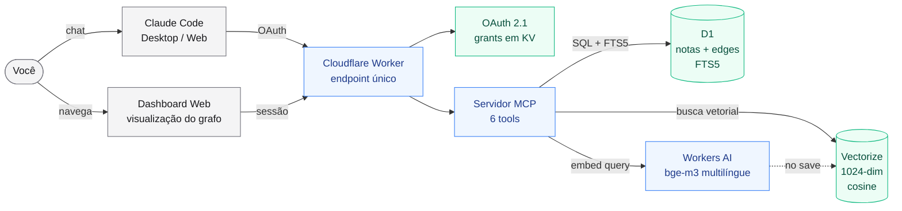
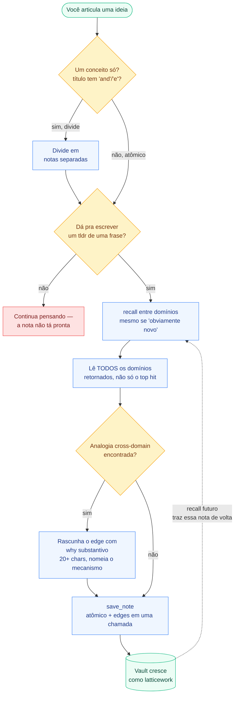

# Mind Vault — um grafo de conhecimento pessoal pro Claude, rodando no Cloudflare


**A ferramenta de pensamento latticework pra quem conversa com o Claude.** Mind Vault é um grafo de conhecimento self-hosted, de usuário único, que roda 100% na sua conta Cloudflare e conecta no Claude Code, Claude Desktop ou Claude Web como servidor MCP. Você conversa com o Claude sobre uma ideia, ele decide o que vale guardar, atomiza o conceito, varre o vault atrás de analogias entre domínios diferentes, e salva a nota com edges que nomeiam o *mecanismo* compartilhado — não só "relacionado".

**Não é um app de notas. É uma ferramenta de pensamento.**

- ✅ **Conceitos, não páginas.** Cada nota é uma ideia só, título em uma linha, resumida numa frase (teste Feynman).
- ✅ **Edges com substância.** 9 tipos de relação (`analogous_to`, `same_mechanism_as`, `contradicts`, `refines`, …), cada uma exigindo um *why* de no mínimo 20 caracteres — o mecanismo por trás da conexão.
- ✅ **Cross-domain por design.** O recall é balanceado por domínio — o vault entrega a conexão inesperada de outro campo, porque é ali que o insight mora.
- ✅ **Multilíngue.** Escreva em português, inglês, ou o que for da conversa. O modelo de embedding (`bge-m3`) recupera em 100+ idiomas.
- ✅ **Soberano.** Tudo vive na sua conta Cloudflare — D1 (SQLite), Vectorize (embeddings), Workers AI. Zero terceiros, zero lock-in, zero assinatura.
- ✅ **OAuth 2.1 + registro dinâmico de cliente.** Claude Desktop e Claude Web plugam só com a URL; sem malabarismo de token.

## Pra quem é isso?

- **Quem vive no Claude Code** e quer que o que aprende se acumule entre sessões, em vez de evaporar no fim de cada conversa.
- **Quem procura uma alternativa "Claude-native" ao Obsidian ou Notion** pra capturar ideias — especificamente no estilo cross-domain, guiado por analogia, do latticework de modelos mentais do Charlie Munger ou do Zettelkasten do Luhmann.
- **Escritores, pesquisadores, pensadores** que leem entre áreas e querem um segundo cérebro que *obriga* a procurar a sobreposição estrutural em vez de enterrar as notas em pastas.

Mind Vault **não é** substituto pra app de captura diária. Ele é pro subconjunto do seu pensamento que vale preservar com rigor — as ideias que você vai querer reencontrar, num contexto diferente, daqui a alguns anos.

## Quando faz sentido (e quando não)

Mind Vault é uma ferramenta opinativa. Não é "notas pro Claude" — é uma disciplina embrulhada num servidor MCP. Antes de instalar, bate as duas listas abaixo.

### ✅ Use o Mind Vault se…

- **Você lê ou trabalha entre múltiplos domínios** e quer que as analogias estruturais entre eles apareçam sozinhas. O ponto do vault é notar que um padrão que você acabou de ver em engenharia de software é a mesma forma de algo que você leu em biologia evolutiva ano passado.
- **Você já vive dentro do Claude Code, Claude Desktop ou cliente compatível com Claude.** Mind Vault é um servidor MCP — o valor vem de estar ao alcance sem sair da conversa.
- **Você toma decisões de julgamento cujo raciocínio vale preservar** — decisões de design, conclusões de pesquisa, apostas estratégicas. O vault protege o *porquê* pra você revisitar depois.
- **Você tá no Pro, Max ou na API** e pode arcar com os ~2.400 tokens de overhead por requisição fria. No Max 5x/20x isso é desprezível.
- **Você compra o método Munger/Luhmann**: um conceito por nota, links com *whys* substantivos, estrutura cross-domain em vez de pastas. Se você não compra o método, a ferramenta vai parecer atrito.

### ❌ Pula o Mind Vault se…

- **Você tá no Claude Free.** O overhead do MCP come ~27% da sua janela de 5h antes de você digitar qualquer coisa. Não compensa.
- **Você quer diário ou lista de tarefa.** O vault é rigoroso por design — rejeita captura efêmera. Usa Obsidian, Notion ou Apple Notes.
- **Você trabalha só num domínio estreito.** A proposta de valor é recall cross-domain. Quem atua num domínio só extrai quase tudo de uma pasta de markdown simples + `grep`.
- **Você não usa o Claude como interface principal.** O vault é navegável por um dashboard web, mas a disciplina de *escrita* só funciona quando tem um LLM mediando o fluxo de save. Sem isso, você vai voltar a despejar notas.
- **Você quer um segundo cérebro que captura tudo.** Mind Vault pune saves de baixo sinal — notas relaxadas poluem recalls futuros. Se você não consegue articular um tldr de uma frase, a nota não tá pronta.
- **Você precisa de acesso offline ou armazenamento local.** O vault roda no D1 + Vectorize da Cloudflare. Suas notas saem da sua máquina.
- **Você se importa em preservar a forma exata do que escreveu.** O vault empurra pra atomização e reescrita — é ferramenta de pensamento, não de arquivo.

### A frase honesta

Mind Vault vale a pena quando você trata ele como **uma disciplina pras ideias que você vai querer de volta**, não como lugar pra despejar coisa. Se essa distinção não ressoa, você provavelmente ainda não precisa dele.

## 💰 Custo: R$ 0 — roda inteiro no free tier da Cloudflare

Antes de sair deployando, lê isso: **você não vai ser cobrado**. Mind Vault roda no free tier da Cloudflare, que é generoso o suficiente pra um vault pessoal nunca chegar perto dos limites:

| Serviço | Free tier | O que um vault pessoal consome |
|---|---|---|
| Workers (o servidor) | 100.000 requisições/dia | ~50 reqs/dia em uso ativo |
| D1 (o banco) | 5 GB de armazenamento, 5M leituras/dia, 100k escritas/dia | Alguns MB, centenas de leituras |
| Vectorize (a busca) | 5M vetores armazenados, 30M queries/mês | Alguns milhares no máximo |
| Workers AI (embeddings) | 10.000 neurônios/dia | Algumas centenas |
| KV (tokens OAuth + cache do grafo) | 100k leituras/dia, 1k escritas/dia (por namespace) | Poucas leituras por login + layout de grafo cacheado |

**Não precisa de cartão de crédito** pra criar conta na Cloudflare. Dá pra cadastrar só com email em [cloudflare.com/sign-up](https://dash.cloudflare.com/sign-up), confirmar o email, e pronto. Mesmo se você estourasse o free tier (não vai), a Cloudflare mostra aviso antes de cobrar qualquer coisa — nunca uma fatura surpresa.

## ⚠️ O custo real: tokens do Claude

A infra é grátis, mas conectar o MCP ao Claude **não é** grátis do ponto de vista do orçamento de tokens. Você precisa entender isso antes de decidir se Mind Vault vale pro seu padrão de uso.

### O que custa

| Custo | Tokens | Quando você paga |
|---|---|---|
| Overhead sempre-ligado do MCP | **~2.400** | Toda requisição enquanto o MCP tiver conectado (cacheável, TTL de 5 min) |
| Skill `using-mind-vault` | ~1.300 | Só quando a skill é invocada (não invoque se o MCP tá conectado — duplica as descrições de tool) |
| Resposta do `recall` | 100–300 | Por chamada (retorna só os tldrs, nunca o corpo — barato por design) |
| Resposta do `get_note` | 500–2.000 | Por chamada (corpo completo) |

Os ~2.400 tokens vêm das descrições de tool e instruções de uso que o MCP injeta no system prompt ([`src/mcp/instructions.ts`](src/mcp/instructions.ts) + os 6 schemas de tool). Eles carregam em **toda** requisição enquanto o MCP tá conectado, use você o vault naquele turno ou não. O cache de prompt (TTL de 5 min) torna isso quase grátis em conversa contínua, mas você repaga em todo cold start.

### Impacto por plano do Claude

A Anthropic não publica quotas exatas pros planos de consumidor, mas a leitura prática baseada em números observados pela comunidade:

| Plano | Janela de uso | Orçamento observado | Overhead MCP como % da janela |
|---|---|---|---|
| **Free** | 5h rolling | muito apertado (~9k tok efetivos) | ~27% — **não use** Mind Vault no Free |
| **Pro** (US$ 20/mês) | 5h rolling + limite semanal | ~44k tok por janela de 5h | ~5,5% por requisição fria |
| **Max 5x** (US$ 100/mês) | 5h rolling + limite semanal | ~220k tok por janela de 5h | ~1,1% |
| **Max 20x** (US$ 200/mês) | 5h rolling + limite semanal | ~880k tok por janela de 5h | ~0,3% |
| **API** (Claude Code / SDK) | sem janela, paga por token | ilimitado | cobrado direto (~US$ 0,036/turno frio no Opus, ~US$ 0,0036 com cache) |

Pontos importantes sobre as janelas dos planos:

- **Todos os planos pagos usam janela rolling de 5h**, não reset diário. Mensagens caem 5h depois do envio. Confere em `/usage` no Claude Code ou em `claude.ai/settings/usage` pra ver o contador ao vivo.
- **Limites semanais foram adicionados em agosto/2025** no Pro e Max pra usuários pesados, além da janela de 5h. O overhead fixo do Mind Vault também conta pro semanal.
- **Horário de pico queima mais rápido**: em dia de semana, 5–11h PT / 13–19h GMT, a Anthropic aperta os limites da sessão de 5h durante alta demanda. Uma sessão com MCP conectado e 10 turnos frios no pico pode comer um pedaço notável da janela Pro.
- **Billing da API é o modelo oposto**: sem janela, mas cada token é medido. Aqui o overhead do MCP vira linha de custo real. Disciplina de cache importa mais.

### Recomendações práticas

1. **Plano Free**: nem vale. O overhead do MCP come muito da sua janela minúscula.
2. **Plano Pro**: conecta o MCP seletivamente. Em conversa que vai mexer no vault, deixa ligado. Em uma hora de UI ou debug, desconecta — você ganha bem mais folga na janela de 5h.
3. **Max 5x / 20x**: deixa ligado. O overhead é <1% da janela e a disciplina codificada nas descrições de tool se paga na primeira vez que ela impede uma nota ruim.
4. **API / Claude Code**: deixa ligado em sessões focadas no vault, desconecta em outras. Você paga por token de qualquer jeito; calor do cache é a sua melhor alavanca.
5. **Nunca invoca a skill `using-mind-vault` com o MCP conectado** — duplica ~1.300 tokens de orientação que o MCP já carregou. A skill existe pra ambientes de fallback (Gemini, Codex, etc) sem suporte a MCP.
6. **Agrupa as interações com o vault** numa mesma sessão. Cinco recalls seguidos ficam em cache e são quase de graça. Cinco recalls espalhados pelo dia pagam cold start cada um.
7. **Prefere `recall` a `get_note`.** Lê o corpo completo só quando o tldr não der conta. Uma nota de 2k tokens lida 5 vezes numa sessão são 10k tokens indo embora.

Pra metodologia completa e o breakdown por tool, veja [docs/token-cost.md](docs/token-cost.md).

## Quickstart — deixa sua IDE agêntica fazer o trabalho

Mind Vault é configurado pela sua IDE agêntica (Claude Code, Cursor, Windsurf, etc), não por wizard web. O repo traz um runbook determinístico em [CLAUDE.md](CLAUDE.md) que o agente segue ponta a ponta. **A única coisa que você digita é email e passphrase.** Tudo o mais — provisionar D1, Vectorize, KV, hashear a passphrase, gerar o session secret, subir os secrets, fazer deploy, aplicar o schema — é feito pra você.

**O que você precisa:**

- Um computador com Node.js 20+ ([nodejs.org](https://nodejs.org))
- Uma conta Cloudflare gratuita ([cadastro](https://dash.cloudflare.com/sign-up) — sem cartão)
- Uma IDE agêntica conectada ao Claude

**O fluxo:**

```bash
git clone https://github.com/orobsonn/mind-vault.git
cd mind-vault
npm install
npx wrangler login   # abre o browser → clica "Allow" → pronto
```

Agora abre a pasta na sua IDE e diz:

> Configura o Mind Vault.

O agente lê o [CLAUDE.md](CLAUDE.md), te pede email e passphrase (12+ caracteres), e roda o runbook completo. Quando termina, ele te devolve a URL do Worker e a linha pra conectar o Claude Code ao MCP:

```bash
claude mcp add --transport http mind-vault https://<seu-worker>.workers.dev/mcp
```

Instala a skill `using-mind-vault` (o agente te passa o link) e cola o bloco de personalização que ele mostra.

### Primeira conversa

Abre o Claude e joga uma ideia:

> "Acabei de sacar que tech debt se comporta como juros compostos — quanto mais você ignora, pior fica a taxa."

O Claude chama `MindVault:recall` pra varrer o vault atrás de analogias, aí oferece salvar a nota com `MindVault:save_note`, atomizando em um conceito por nota e criando edges com justificativas *why* substantivas. Você vê as chamadas de tool MCP acontecendo na UI da conversa.

### O que você vai ver


*Tela de notas — cada conceito atomizado, tldr como teste Feynman, domínios o mais estreitos possível.*


*Tela de grafo — física force-directed com reveal no estilo Obsidian. Linhas roxas sólidas são edges explícitos; tracejadas em teal são edges de similaridade semântica emergidos pelo modelo de embedding; nós são coloridos por domínio.*

## Arquitetura



Um único Cloudflare Worker serve três responsabilidades na mesma URL:

| Rota | Função |
|---|---|
| `/` | Landing page — quando configurado, mostra status do vault com badge de conexão + URL MCP pronta pra copiar + download da skill + prompt de personalização. Quando não configurado, mostra uma página estática "termine o setup pela sua IDE agêntica" apontando pro [CLAUDE.md](CLAUDE.md). |
| `/authorize`, `/token`, `/register` | OAuth 2.1 via `@cloudflare/workers-oauth-provider` com registro dinâmico de cliente |
| `/mcp` | Endpoint MCP protegido por OAuth, servido por `McpAgent` (`agents/mcp`) envolvendo `McpServer` do `@modelcontextprotocol/sdk` |
| `/skill/using-mind-vault.zip` | O ZIP da skill servido como asset estático |
| `/status` | Status do vault em JSON (notas, edges, clientes OAuth, tokens ativos, estado de conexão) |

**Bindings (tudo no `wrangler.toml`):**
- `DB` — D1 (SQLite) pra notas, edges, tags, FTS5
- `VECTORIZE` — índice 1024-dim cosine, um vetor por nota
- `AI` — Workers AI, modelo `@cf/baai/bge-m3` pra embeddings multilíngues
- `OAUTH_KV` — namespace KV pra grants/tokens/registros de cliente OAuth
- `GRAPH_CACHE` — namespace KV cacheando o layout pré-computado do grafo pro dashboard web
- `ASSETS` — assets estáticos (ZIP da skill)

**Schema (5 tabelas):**
- `notes(id, title, body, tldr, domains JSON, kind, created_at, updated_at)`
- `notes_fts` (FTS5 virtual em title + tldr + body, sincronizado por triggers)
- `tags(note_id, tag)` (escape hatch; a estrutura real mora nos edges)
- `edges(id, from_id, to_id, relation_type, why, created_at)` com `CHECK` enum de 9 tipos de relação e `UNIQUE(from_id, to_id, relation_type)`
- `meta(key, value)` pra metadados singleton

## Tools MCP (o que o Claude chama)

| Tool | Função |
|---|---|
| `save_note` | Nota atômica + edges em uma única chamada. Valida `why` de edge ≥ 20 chars, slugs de domínio contra regex, existência do edge target. |
| `recall` | Busca híbrida: embedding Workers AI + FTS5, mesclados e **balanceados por domínio** (máx 3 por domínio, até 5 domínios distintos). Retorna só `{id, title, domain, kind, tldr}` — nunca o corpo. |
| `expand` | Vizinhos de 1 hop de uma nota no grafo. |
| `get_note` | Corpo completo + tags + edges de uma nota por id. |
| `link` | Cria um edge entre duas notas existentes (pra quando o Claude detecta conexão entre saves anteriores no meio da conversa). |

As descrições de tool são escritas em inglês com instruções de fluxo obrigatório ("chama `recall` antes de `save_note`") e mensagens de erro pedagógicas ("se a conversa tá em português e você ia usar `biologia-evolutiva`, usa `evolutionary-biology` no lugar") que ensinam o Claude a se recuperar de erro em um shot.

## Método e linhagem intelectual



Isso não é projeto de sala limpa. Cada decisão tem raiz numa tradição:

- **Charlie Munger** — latticework de modelos mentais, o valor do pensamento cross-domain. Norte.
- **Scott E. Page**, *The Model Thinker* — teorema da previsão por diversidade (diversidade de modelos bate profundidade de um). Base pro **recall balanceado por domínio**.
- **Douglas Hofstadter & Emmanuel Sander**, *Surfaces and Analogies* — analogia como núcleo da cognição. Base pro peso dos edges `analogous_to` e `same_mechanism_as`.
- **Dedre Gentner**, *Structure-Mapping Theory* — a distinção entre similaridade superficial e estrutural. Mantém os edges honestos.
- **Niklas Luhmann / Sönke Ahrens**, *How to Take Smart Notes* (Zettelkasten) — notas atômicas, links com substância, estrutura emergente. Base pro "um conceito uma nota", "nunca linka sem um why" e "nem toda conversa vira nota".
- **Richard Feynman** — se você não consegue explicar simples, você não entendeu. Base pro campo `tldr` obrigatório.
- **Karl Popper** — falibilismo. Base pros edges `contradicts` e `refines` como cidadãos de primeira classe.

O framing público é **pensamento latticework / grafo de conhecimento multi-modelo**, não "modelos mentais do Munger" — a base acadêmica (Page, Hofstadter, Gentner, Luhmann) é mais rigorosa que os discursos do Munger sozinhos.

## Avançado: auto-deploy no git push (opcional)

> **Pula essa seção se você não tem certeza de que precisa.** O Quickstart acima (com `wrangler login` + `wrangler deploy`) já basta pra uso pessoal — você só re-deploya quando muda o código, e dá pra rodar `wrangler deploy` de novo no terminal.

Esse repo traz um **workflow do GitHub Actions** ([.github/workflows/deploy.yml](.github/workflows/deploy.yml)) que faz auto-deploy pro seu Worker a cada push em `master` ou `main`. Útil se você pretende modificar o Mind Vault e quer suas mudanças subindo automático ao dar push no GitHub.

Pra habilitar no seu fork:

1. Cria um API token da Cloudflare: vai em [dash.cloudflare.com/profile/api-tokens](https://dash.cloudflare.com/profile/api-tokens) → **Create Token** → usa o template "Edit Cloudflare Workers", aí adiciona essas permissões extras: `D1 Edit`, `Vectorize Edit`, `Workers KV Storage Edit`, `Workers AI Edit`. Clica em Continue → Create Token → **copia o token mostrado** (ele não aparece de novo).
2. Copia seu Cloudflare Account ID: em qualquer página do dashboard da Cloudflare, tá na sidebar direita.
3. No seu fork do GitHub, vai em **Settings → Secrets and variables → Actions → New repository secret** e adiciona:
   - `CLOUDFLARE_API_TOKEN` = o token do passo 1
   - `CLOUDFLARE_ACCOUNT_ID` = o account ID do passo 2
4. Dá push de qualquer commit em `master`. O workflow roda `npm run typecheck` + `npm test` + `npm run build:skill` antes do deploy, então teste quebrando bloqueia o deploy.

Dá pra acompanhar as runs em `https://github.com/SEU_USUARIO/mind-vault/actions`.

## Desenvolvimento

```bash
npm install
npm run dev          # wrangler dev no Miniflare local
npm test             # vitest-pool-workers (pool de workers + pool node pra auth)
npm run typecheck    # tsc --noEmit
npm run build:skill  # empacota skills/using-mind-vault/ em assets/using-mind-vault.zip
npm run deploy       # build skill + wrangler deploy
```

Os testes rodam em dois pools: o pool principal de workers (pra testes de D1 + tool MCP com Vectorize / Workers AI mockados), e um pool node separado pro teste de hash de senha (`crypto.subtle` tá disponível nos dois, mas o pool node mantém o módulo de auth isolado das restrições do runtime dos workers).

## Segurança

**Single-user por design.** Não compartilha a URL do Worker. Acesso é gated por OAuth 2.1 usando email + hash de passphrase armazenados como secrets do Worker. A passphrase em si é hasheada com PBKDF2-SHA256 em 100k iterações (cap do Workers — veja `src/auth/password.ts`). Os tokens emitidos pelo OAuth provider ficam no namespace `OAUTH_KV`.

Se você quer versão multi-user, dá fork e adapta — não é mudança plug-and-play. Vai precisar de linhas por usuário no D1, filtro por usuário no Vectorize, e fluxo de registro.

No momento **não tem rate limit de login**. Pull requests bem-vindos.

## Free tier

Os free tiers de D1 + Vectorize + Workers AI bastam pra uso pessoal. Confirma os limites atuais nas páginas de preço da Cloudflare antes de contar com eles pra vaults grandes.

---

Feito por **[Robson Lins](https://github.com/orobsonn)** · [Instagram](https://www.instagram.com/orobsonn) · [X / Twitter](https://x.com/orobsonnn) · [YouTube](https://youtube.com/@orobsonnn)
